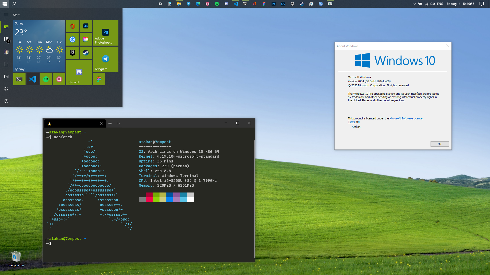

# Windows 10A

My Windows 10 customizations & programs I use. (A for Atakan)

## Contents

- Customizations
  - [Debloat]((https://github.com/Sycnex/Windows10Debloater))
  - Wallpaper: [WinDynamicDesktop](https://github.com/t1m0thyj/WinDynamicDesktop) ([Mojave XP](https://windd.info/themes/Mojave_XP.html))
  - Taskbar Customizatons
    - Small Taskbar Icons
    - Taskbar on top
    - [TaskbarX](https://github.com/ChrisAnd1998/TaskbarX) (for centering icons)
    - [T-Clock Redux](https://github.com/White-Tiger/T-Clock/tags)
      - Time format: `ddd mmm dd   HH:nn:ss`
      - Font: Segoe UI Semibold, 9pt
  - Cursor: [DMZ Black](https://www.deviantart.com/nighted/art/DMZ-Cursors-58429447)
  - Accent Color: #779916
- Programs that I use
  - CLI
    - WSL (ArchWSL)
      - genie
      - yay
      - zsh
    - WinGet
  - Desktop Apps
    - Design & Photo Editing
      - Adobe Creative Cloud
        - Lightroom Classic CC
        - Photoshop CC
      - Inkscape
      - Figma (Desktop PWA)
    - Chatting
      - Discord
      - Telegram
    - Gaming
      - Epic Games Store
      - Steam
      - Uplay
    - Browsing & Internet
      - Edge (Chromium) (Main Browser)
      - Brave
      - Firefox
      - Internet Download Manager
      - qBitTorrent
    - Utilities
      - Windirstat
      - CCleaner
      - 7-Zip
      - PomoDoneApp
      - QTranslate
      - PowerToys
    - Development
      - Visual Studio Code
      - Windows Terminal
    - Multimedia
      - VLC Media Player
      - Spotify
    - Screen Capturing
      - OBS Studio
      - ScreenToGif
      - Lightshot
    - Office
      - Office Online (Desktop PWA)
      - Xodo